<div align="center">



<br/>

<a href="https://github.com/GTC2080?tab=repositories"><strong>Repositories</strong></a>
&nbsp;&nbsp;|&nbsp;&nbsp;
<a href="https://github.com/GTC2080/DeepSeek-Reasonix"><strong>DeepSeek-Reasonix</strong></a>
&nbsp;&nbsp;|&nbsp;&nbsp;
<a href="https://github.com/GTC2080/Nexus_Scientist_Obsidian"><strong>Nexus Scientist Obsidian</strong></a>
&nbsp;&nbsp;|&nbsp;&nbsp;
<a href="https://github.com/GTC2080/DeepSeek-TUI"><strong>DeepSeek-TUI</strong></a>

</div>

## Lab Signal

Chemistry is my base discipline; AI agents and native systems are the instruments I build around it.
I like tools that feel close to the metal, stay local-first, and turn scattered knowledge into something searchable, computable, and fast.

```txt
research notes + molecular intuition + LLM workflow + native kernel
                           |
                           v
        scientific knowledge tools that keep up with thought
```

## Molecular Stack

<table>
  <tr>
    <td width="33%">
      <h3>AI Agents</h3>
      <p>DeepSeek, Claude, Kimi, terminal UX, coding loops, memory-aware workflows.</p>
      <p><code>TypeScript</code> <code>Python</code> <code>Node.js</code></p>
    </td>
    <td width="33%">
      <h3>Native Systems</h3>
      <p>C++ kernels, Rust bridges, Tauri shells, fast local data paths.</p>
      <p><code>C++17</code> <code>Rust</code> <code>SQLite</code></p>
    </td>
    <td width="33%">
      <h3>Chem Knowledge</h3>
      <p>Notes, PDFs, chemistry workflows, retrieval, graph thinking, study tools.</p>
      <p><code>Obsidian</code> <code>Graphs</code> <code>RAG</code></p>
    </td>
  </tr>
</table>

## Core Builds

<table>
  <tr>
    <td width="50%">
      <h3><a href="https://github.com/GTC2080/Nexus_Scientist_Obsidian">Nexus Scientist Obsidian</a></h3>
      <p><strong>Scientific workspace for chemistry-heavy knowledge work.</strong></p>
      <p>C++ kernel-driven notes, PDFs, retrieval, chemistry tools, graph views, and study workflows.</p>
      <p><code>C++</code> <code>Tauri</code> <code>React</code> <code>Knowledge Graph</code></p>
    </td>
    <td width="50%">
      <h3><a href="https://github.com/GTC2080/DeepSeek-Reasonix">DeepSeek-Reasonix</a></h3>
      <p><strong>DeepSeek-native coding agent for terminal-first work.</strong></p>
      <p>Built around long-running agent sessions, prefix-cache stability, and practical developer flow.</p>
      <p><code>TypeScript</code> <code>AI Agent</code> <code>Terminal UX</code></p>
    </td>
  </tr>
  <tr>
    <td width="50%">
      <h3><a href="https://github.com/GTC2080/DeepSeek-TUI">DeepSeek-TUI</a></h3>
      <p><strong>Rust TUI coding agent for DeepSeek models.</strong></p>
      <p>Terminal-native interaction layer for coding, reasoning, and local command workflows.</p>
      <p><code>Rust</code> <code>TUI</code> <code>LLM Tooling</code></p>
    </td>
    <td width="50%">
      <h3><a href="https://github.com/GTC2080/EUI-NEO">EUI-NEO</a></h3>
      <p><strong>Low-overhead C++17 UI framework.</strong></p>
      <p>Cross-platform UI experiments built on OpenGL and GLFW.</p>
      <p><code>C++17</code> <code>OpenGL</code> <code>GLFW</code></p>
    </td>
  </tr>
</table>

## Reaction Map

| Input | Catalyst | Output |
| --- | --- | --- |
| Chemistry coursework and research reading | AI retrieval, graph thinking, PDF workflows | Better scientific memory systems |
| Developer friction in terminal workflows | DeepSeek, Claude, Kimi, local tooling | Faster coding agents |
| Slow UI or backend loops | C++ kernels, Rust bridges, Tauri | Native-feeling desktop tools |
| Long-form creative projects | Memory layers, review loops, planning engines | More coherent AI writing systems |

## Open Repositories

| Project | Signal |
| --- | --- |
| [Nexus_Scientist_Obsidian](https://github.com/GTC2080/Nexus_Scientist_Obsidian) | Chemistry-aware scientific knowledge workspace. |
| [DeepSeek-Reasonix](https://github.com/GTC2080/DeepSeek-Reasonix) | DeepSeek-native AI coding agent. |
| [DeepSeek-TUI](https://github.com/GTC2080/DeepSeek-TUI) | Rust terminal coding assistant. |
| [EUI-NEO](https://github.com/GTC2080/EUI-NEO) | C++17 OpenGL/GLFW UI framework. |
| [Vibe-Trading](https://github.com/GTC2080/Vibe-Trading) | Personal trading agent experiments. |
| [webnovel-writer](https://github.com/GTC2080/webnovel-writer) | Long-form AI writing system with memory and review loops. |
| [evil-read-arxiv](https://github.com/GTC2080/evil-read-arxiv) | AI-assisted paper reading workflow. |

## Current Trajectory

```txt
Chemistry major
  -> scientific knowledge systems
  -> local-first AI agents
  -> native kernels and fast desktop tools
  -> research workflows that feel like instruments
```

<div align="center">

<sub>Building at the intersection of molecules, memory, and machines.</sub>

</div>
